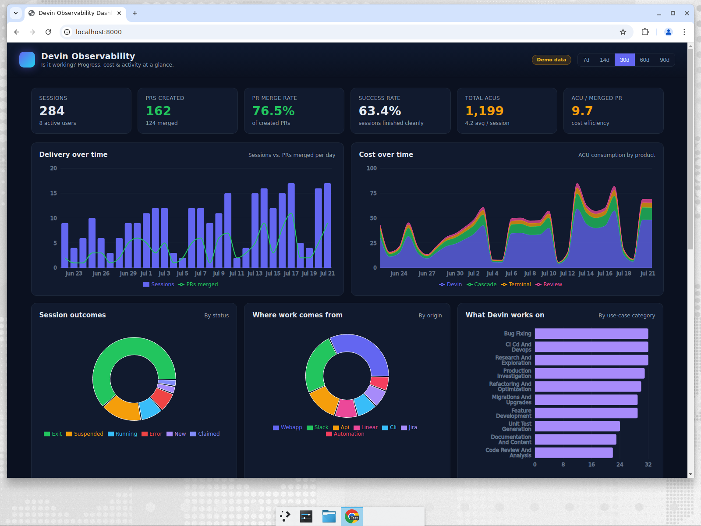

# Devin Observability Dashboard

An observability dashboard for Devin, built on the Devin enterprise API. It is
designed to answer one question an engineering leader actually asks:

> **"If I were an engineering leader, how would I know this is working?"**

It surfaces **progress**, **cost**, and **activity/logs** in a single view, so
you can see delivery, spend, adoption, and reliability at a glance.



## What it shows

**Executive KPIs**
- Sessions run & active users
- PRs created and merged
- **PR merge rate** — are Devin's PRs actually landing?
- **Success rate** — share of sessions that finished cleanly
- **Total ACUs** (cost) and **avg ACU / session**
- **ACU per merged PR** — a blunt cost-efficiency / ROI signal

**Progress**
- Sessions vs. PRs merged per day (delivery trend)
- Session outcomes by status (finished / suspended / running / error)
- What Devin works on, by use-case category

**Cost**
- ACU consumption over time, stacked by product (Devin / Cascade / Terminal / Review)
- Top spenders (ACU by user)

**Adoption & activity**
- Where work comes from (webapp / Slack / API / Linear / Jira / CLI / automation)
- Busiest repositories
- A searchable, filterable **recent-sessions feed** — click any row to read the
  full session log (messages) in a side drawer.

## Architecture

```
frontend (React + Vite + Recharts)         backend (FastAPI)
  └── GET /api/overview      ─────────►      aggregate.py  ── normalizes ──┐
  └── GET /api/sessions/:id/messages         devin_client.py               │
                                                   │                       ▼
                                                   └── Devin API (v3)   or  mock_data.py
```

- The API credential lives **only on the backend** and is never exposed to the
  browser. The frontend only ever talks to `/api/*`.
- **No credential? It just works.** The backend serves a realistic, deterministic
  demo dataset so you can explore the dashboard immediately.
- All aggregation (KPIs, time bucketing, group-bys) happens server-side; the
  frontend renders pre-computed numbers.

### Devin API endpoints used

| Purpose | Endpoint |
| --- | --- |
| Sessions (progress, activity, PRs, categories, origins) | `GET /v3/enterprise/sessions` |
| Cost by product over time | `GET /v3/enterprise/consumption/daily` |
| Session log drill-down | `GET /v3/enterprise/sessions/{devin_id}/messages` |
| User display names | `GET /v3beta1/organizations/{org_id}/members/users` |

## Quick start

Requirements: Python 3.10+ and Node 18+.

```bash
# 1. install backend + frontend deps and build the frontend
make install
make build

# 2. run the server (serves the built dashboard + API on http://localhost:8000)
make backend
```

Open http://localhost:8000. With no credential set you'll see **demo data**.

### Use live data

```bash
cp .env.example .env
# edit .env and set DEVIN_API_KEY=cog_...  (or apk_user_...)
cd backend && . .venv/bin/activate && set -a && source ../.env && set +a \
  && uvicorn app.main:app --host 0.0.0.0 --port 8000
```

The credential can be either:
- a **v3 service-user token** (`cog_...`) with the `ViewAccountConsumption`
  permission at the enterprise level, or
- an **enterprise-admin personal API key** (`apk_user_...`).

Generate keys at [Settings → API Keys](https://app.devin.ai/settings/api-keys).

### Development (hot reload)

```bash
# terminal 1 — backend API on :8000
make backend
# terminal 2 — Vite dev server on :5173 (proxies /api to :8000)
make dev
```

## Configuration

| Variable | Default | Description |
| --- | --- | --- |
| `DEVIN_API_KEY` | _(unset)_ | Bearer credential. Unset ⇒ demo mode. |
| `DEVIN_API_BASE_URL` | `https://api.devin.ai` | API base URL. |
| `DEVIN_API_TIMEOUT` | `30` | Per-request timeout (seconds). |
| `DEVIN_DASHBOARD_FORCE_MOCK` | `0` | Set `1` to force demo data even with a key. |

## Notes & limitations

- ACU totals in the KPI cards are summed from session-level `acus_consumed`.
  The **Cost over time** chart prefers the authoritative per-product breakdown
  from the consumption endpoint when available, and falls back to a modeled
  split otherwise.
- Repository is derived from PR URLs (Devin's session objects don't carry a repo
  field directly).
- Responses are cached in-process for 2 minutes to stay well within API rate limits.
